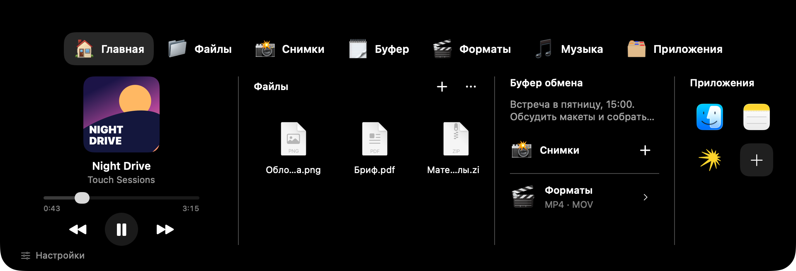
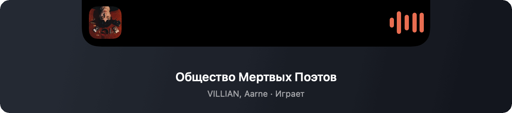
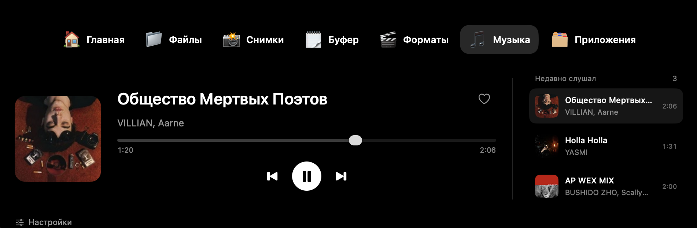
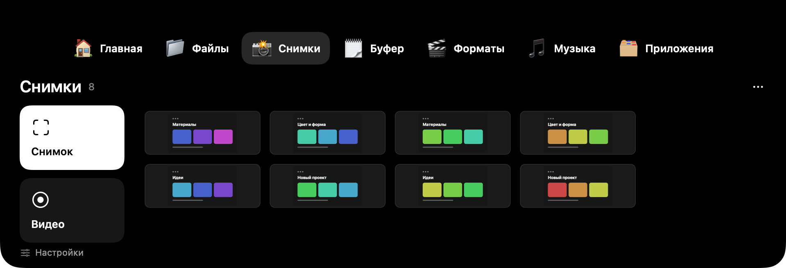
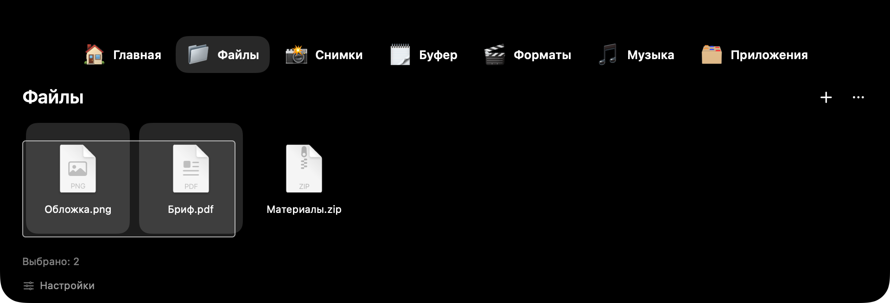

<h1 align="center">Touch</h1>

<p align="center">Музыка, файлы и снимки экрана — у чёлки MacBook.</p>

<p align="center">
  
  
  <a href="LICENSE"></a>
</p>



Нативное приложение на SwiftUI и AppKit. Открывается по наведению, сворачивается обратно в чёлку и оставляет нужное под рукой.

[Видео: Touch за 30 секунд](https://github.com/loddyseven/Touch/releases/download/v2.4.12/Touch-30s-Vertical.mp4) · [Скачать Touch для Apple Silicon](https://github.com/loddyseven/Touch/releases/latest)

## Интерфейс

### Музыка

В свёрнутом виде Touch оставляет обложку слева от чёлки и визуализатор справа. Его цвет подстраивается под обложку. Шесть тонких полосок реагируют на бочку, снейр, хлопки и хэты: первая подчёркивает удар, остальные показывают разные частоты с плавным спадом. Фильтр подавляет вокальные гармоники; это анализ ударных, а не отделение вокала от записи. На паузе чёлка остаётся на месте.



Наведи курсор на чёлку — откроется панель. Во вкладке «Музыка» доступны перемотка, управление воспроизведением и три недавно прослушанных трека.



### Снимки и запись экрана

Два действия слева, галерея справа. Системные скриншоты тоже попадают сюда.



### Файлы

Выделение рамкой, действия по правому клику и перетаскивание всей группы.



## Возможности

- Музыка в чёлке: обложка, визуализатор, перемотка и недавно прослушанные треки в Яндекс Музыке.
- Файлы с выделением рамкой, перетаскиванием и AirDrop.
- Снимки области и окна, история системных скриншотов `⌘⇧3` и `⌘⇧4`.
- Запись экрана со звуком Mac.
- Распознавание текста через Apple Vision.
- История буфера обмена для текста и изображений.
- Конвертация видео в MP4, MOV и MKV.
- Быстрый запуск приложений и автозапуск Touch при входе.

Наведи курсор на чёлку или нажми `Control + Option + Пробел`, чтобы открыть панель. `Esc` сворачивает её. В «Файлах» и «Снимках» можно выделять элементы рамкой; действия с выбранными доступны по правому клику.

## Требования

- macOS 14 или новее. Для записи видео нужна macOS 15+, для визуализатора — 14.2+.
- Сборка проверена на Mac с Apple Silicon.
- Для управления Яндекс Музыкой нужно её настольное приложение и разрешение «Универсальный доступ».
- Для MKV и входящих WebM нужен `ffmpeg`. MP4 и MOV используют средства macOS.

## Сборка

Нужны Xcode с компилятором Swift 6 и CMake.

```sh
git clone --recurse-submodules https://github.com/loddyseven/Touch.git
cd Touch
TOUCH_ENABLE_MEDIA_REMOTE=1 bash scripts/build.sh
open dist/Touch.app
```

Готовое приложение появится в `dist/Touch.app`. Перенеси его в «Программы» перед включением автозапуска. Сборка подписывается локально, без нотарификации Apple.

Без медиамоста можно собрать командой `bash scripts/build.sh`; в этом режиме CMake не требуется.

```sh
bash scripts/test.sh
```

Тесты используют временные файлы и отдельный буфер обмена.

## Данные и разрешения

Touch сохраняет свои снимки и записи в `~/Pictures/NotchHub`. Очистка списка в приложении не удаляет оригиналы. История буфера и недавно прослушанных треков хранится в памяти до выхода.

Для захвата экрана и звука macOS запрашивает соответствующие разрешения. Подключение Яндекс Музыки настраивается в Touch. При установке на другой Mac разрешения выдаются заново.

Если запись не удалось завершить, Touch оставляет исходный файл и сохраняет локальный отчёт с версией macOS, режимом записи и кодом ошибки. Кнопка «Файл и подробности» показывает их в Finder; незавершённые записи доступны и после перезапуска.

## Лицензия

[MIT](LICENSE). Зависимость [mediaremote-adapter](https://github.com/ungive/mediaremote-adapter) распространяется по BSD-3-Clause; её лицензия сохранена в подмодуле.
